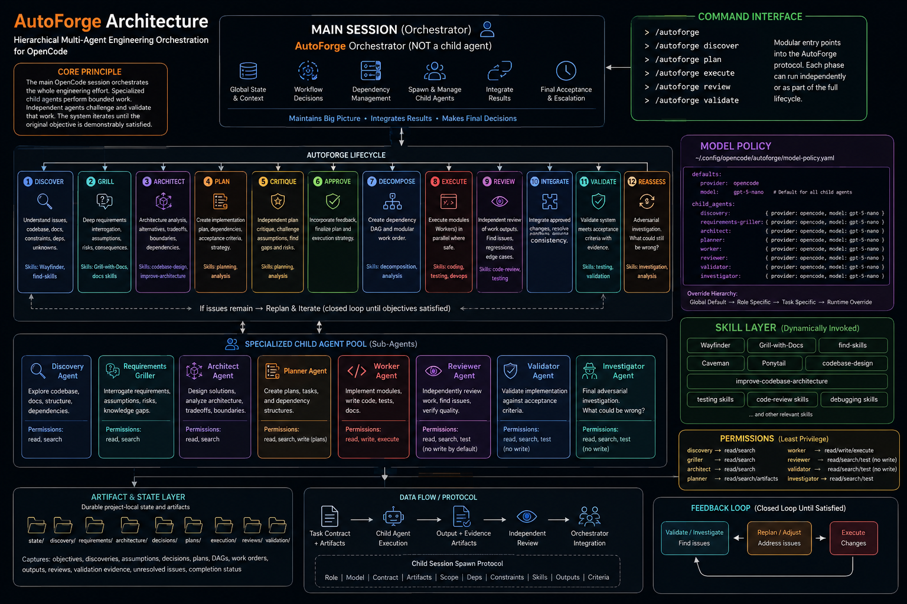

# AutoForge Architecture

**Figure — AutoForge hierarchical multi-agent orchestration for OpenCode.** Main session (Orchestrator) owns global state, workflow decisions, dependency management, child-agent spawning, integration, and final acceptance. 12-phase lifecycle `Discover → Grill → Architect → Plan → Critique → Approve → Decompose → Execute → Review → Integrate → Validate → Reassess` loops until validated satisfaction. Child agents (8) are specialized, least-privilege, skill-routed.

- **Command interface:** `/autoforge` (full) + `discover, plan, execute, review, validate` — modular entry points into the lifecycle (`commands/`).
- **Model policy:** `autoforge/_shared/model-policy.yaml` + `model-registry.yaml` — see Addendum D1/D2 below (diagram’s MODEL POLICY snippet shows the original uniform `gpt-5-nano` default; live policy now routes `planner/reviewer/architect → gpt-5` for critical tasks).
- **Skill layer:** Wayfinder, Grill-with-Docs, find-skills, Caveman, Ponytail, codebase-design, improve-codebase-architecture, testing/review/debugging.
- **Artifact & state:** durable `.autoforge/` project-local state; data flow `Task Contract → Child Execution → Output+Evidence → Review → Orchestrator Integration`; spawn protocol `Role|Model|Contract|Artifacts|Scope|Deps|Constraints|Skills|Outputs|Criteria`.
- **Source:** `autoforge-architecture.md` (1121-line spec, ICM System Map + pipeline) — see `SPEC-ADDENDUM.md` for intentional divergences.

> PNG: `docs/architecture.png` (copied from `ChatGPT Image Aug 29, 2026, 12_44_46 AM.png`). Keep <500KB via `pngquant` if needed; original 1.8M retained.
